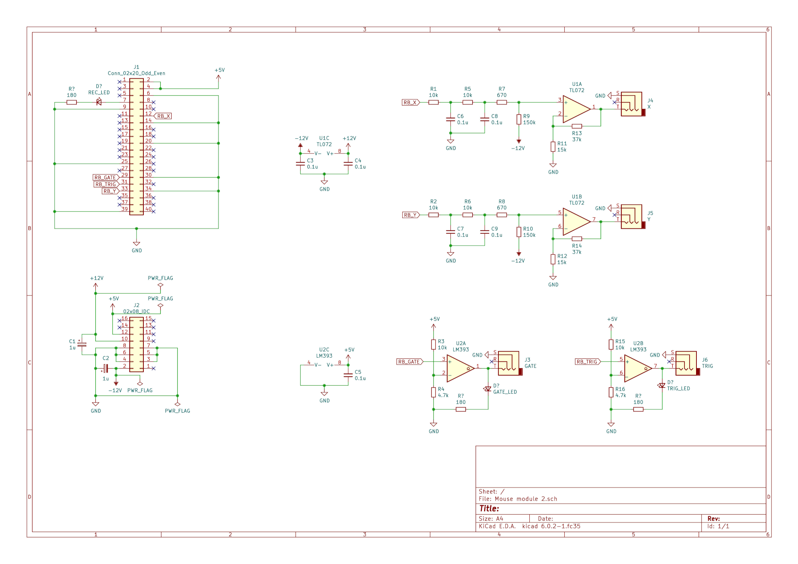

# MouseModule [WORK IN PROGRESS]

This is an eurorack module that processes mouse events through the [Raspberry Pi]() and generates some analog signals. It offers also recording and playback capabilities with more complex mice.

## Build instructions 

This is a pretty simple module to build and try if you have a Raspberry Pi.

### Hardware

Inside the repository (in the KiCad folder) you'll find the schematic (the PCB is still WIP) that you can use to build a very simple prototype on a breadboard. All you need are some passive components, a general purpose opamp and a comparator (used as level translator from 3.3V to 5V).  
GPIO 4 can be tied to an LED to get visual feedback when you're recording. Same for GPIO 17 which signals that you're playing back the recorded events.

<p></p>

### Software

The program is written in C and it captures all the relevant mouse vents in order to fenerate the appropriate hardware signals on spcific GPIOs. The software should be run on the miniaml version of the Pi OS (Raspberry Pi OS Lite) because of the lack of a graphical server which could behave weirdly with the mouse events. In order to compile it yuo need to install the [`pigpio` library]() which requires privileged permissions to run.

```sh
# clone the repository
git clone https://github.com/FingerprintLab/MouseModule.git
cd MouseModule

# install the dependency
sudo apt update && sudo apt upgrade -y
sudo apt install -y pigpio

# compile
cd Software
make

# run
sudo ./main
```

## Features

These are the main features of the module:

- Mouse position -> 2 analog signal for each coordinate
- Left button -> Trigger
- Right button -> Gate
- Middle button -> Change mode (attenuation or offset)
- Wheel -> Increase/decrease attenuation or offset (based on current mode)
- Extra button -> Start/stop the recording
- Side button -> Erase the recording
